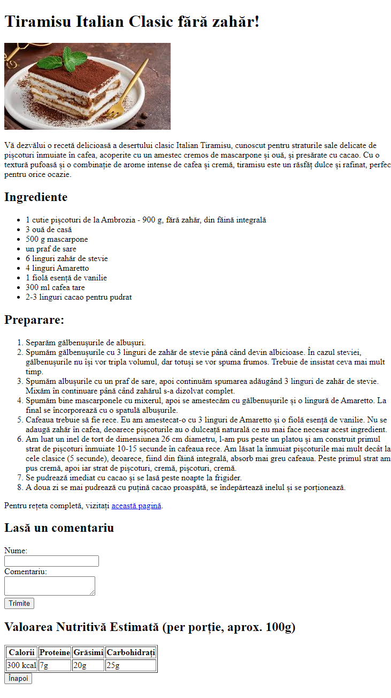

# Recipe for sugar-free Tiramisu

## I created an HTML document that will represent a page with a recipe for a certain dish according to the following structure:

- [x] Add a level one title with the name of the dish.
- [x] Add an image of the dish using the  tag and include the alt attribute.
- [x] Add a paragraph that contains a short description of the dish.
- [x] Create an unordered list to enumerate the necessary ingredients.
- [x] Create an ordered list to enumerate the step-by-step instructions for preparation.
- [x] Add a link to an external page that contains the full recipe.
- [x] Create a form with fields for name and comment. Use the required attribute to make these fields mandatory.
- [x] Create a table to display nutritional information, such as the number of calories, protein, fat, and carbohydrates.
- [x] Add a "Back" button that, when clicked, returns the user to the previous page in the browsing history.

## Live Preview

<a href="https://html-preview.github.io/?url="</a>

## Screenshot

