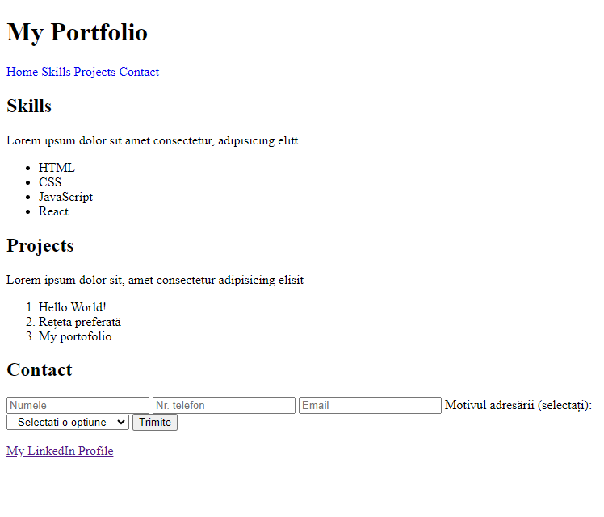

# The first version of My Portfolio

## I built a webpage titled "My Portfolio" following this structure:

- [x] Header: Title, navigation to sections: Home, Skills, Projects, Contact
- [x] The "Skills" and "Projects" sections have a title, description, and a list
- [x] The "Contact" section contains a contact form with fields: name, phone number, email, reason for contact (select one option - interview or hiring)
- [x] The footer contains text and a link to the LinkedIn page.

## Live Preview

<a href="https://html-preview.github.io/?url=https://github.com/Vasile-Go/ODC-Practical-exercises/blob/main/03-My-portfolio-V1/MyPortfolioV1.html" target="_blank">My Portfolio V1</a>

## Screenshot

