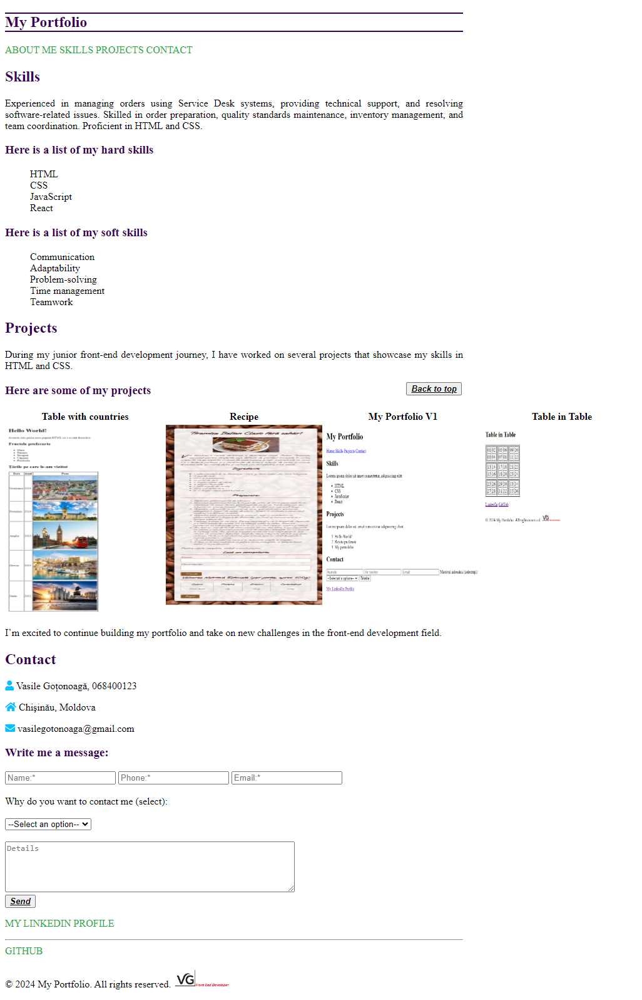

# The final version of my portfolio

## To style the typography of the "My Portfolio" and "About Me" pages using a single external CSS file for both documents as follows:

- [x] All paragraphs should be justified.
- [x] All h1-h6 headings should be bold and colored #370050, and the h1 heading should have lines both above and below it with a thickness of 2px.
- [x] All links should be colored #17AB33, in uppercase, and not underlined.
- [x] Lists should have no markers in front of them.
- [x] Buttons should have their text in italic, underlined, and bold.
- [x] To use Font Awesome icons.
- [x] To style the recipe page to your liking. 

## Live Preview

<a href="https://html-preview.github.io/?url=https://github.com/Vasile-Go/ODC-Practical-exercises/blob/main/05-My-portfolio-Final/MyPortfolioFinal.html" target="_blank">My Portfolio Final</a>

## Screenshot

